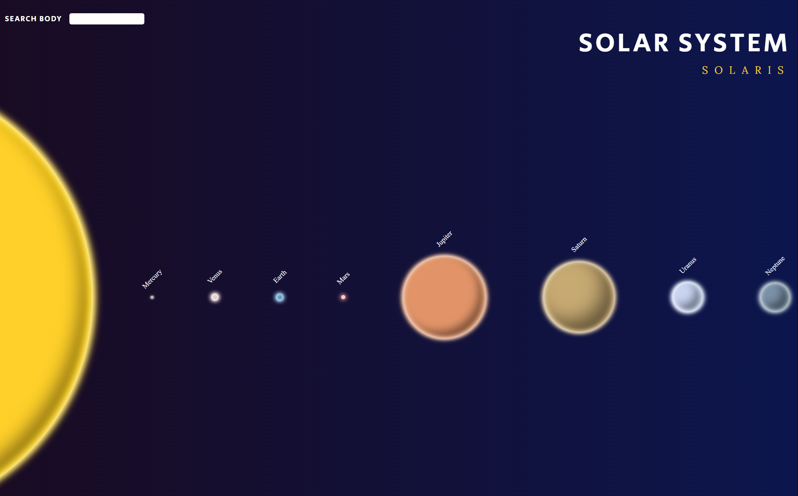

# SOLARIS
A simple webpage of our Solar System with search/filter functionality built with JavaScript, React, TypeScript, SASS and framer-motion with. Package-based architecture.

[](https://skillicons.dev)
## API
```
https://fabiolapoblete.github.io/solaris/data.json
```
## Web APP

Cred to ZoCom for the [design](https://www.figma.com/file/Snw8n1gba7Mbk6TCLEAB1A/JS-%2F-Solaris?node-id=0%3A1)

